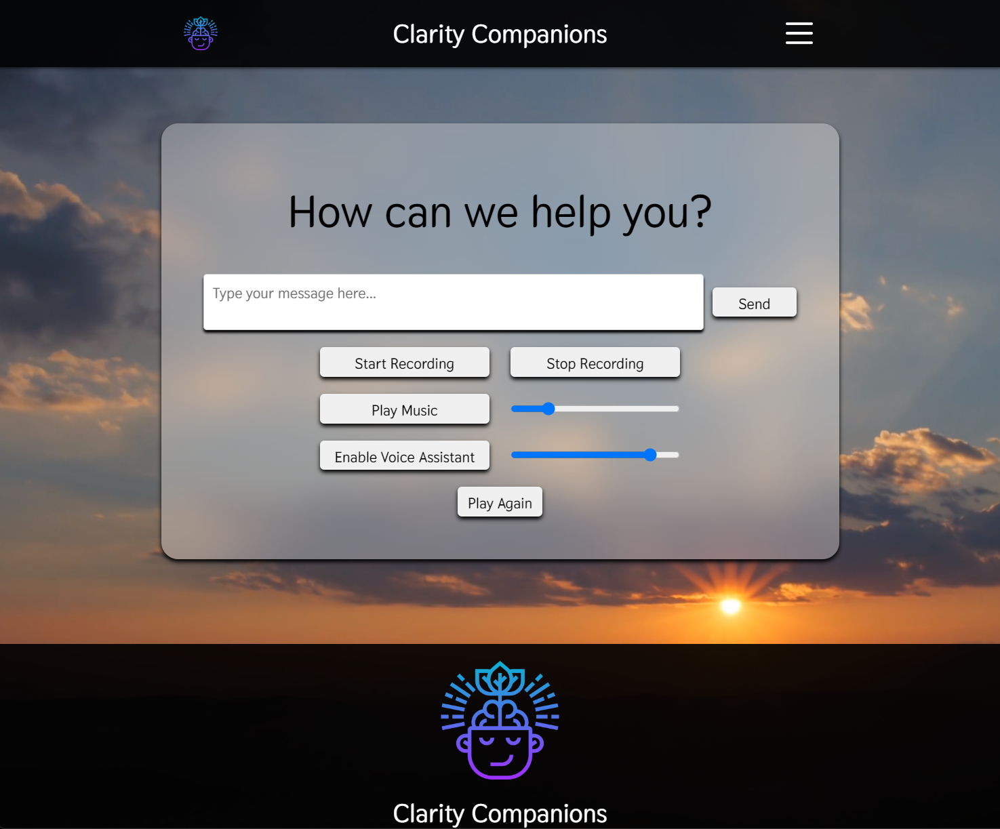

<h1><a href="https://www.loom.com/share/10bb895f0dea423282287bbd2b42f176?sid=b47bc7ff-5bdb-41e7-9d23-12efda8c9480" target="_blank">Clarity Companions</a></h1>

<h2><a href="https://www.loom.com/share/10bb895f0dea423282287bbd2b42f176?sid=b47bc7ff-5bdb-41e7-9d23-12efda8c9480" target="_blank">View Demo</a></h2>

## License

Copyright (c) 2023 Isaiah Sinnathamby. All rights reserved.

Unauthorized copying of this software, via any medium, is strictly prohibited.

## Overview

Clarity Companions is a versatile AI chatbot designed to assist with motivation, therapy, and various other personal needs. Built on a powerful machine learning algorithm, the application aims to deliver personalized and impactful interactions. Developed with a tech stack that includes React, Node.js, Express, and various APIs, Clarity Companions offers a secure and user-friendly experience.

## Features

- **Personalized Conversations:** Uses AI algorithms to understand user context and mood, delivering custom-tailored responses.
  
- **Multi-Functional:** Ideal for a range of use-cases including motivation, therapy, daily planning, and more.

- **Real-time Interactions:** Immediate response time to ensure a fluid, conversational experience.
  
<!-- - **Data Security:** Advanced encryption methods to ensure user data remains confidential. -->
  
<!-- - **User Analytics:** In-app analytics to track interaction history and user engagement. -->
  
- **Multi-Language Support:** Can continue conversations in over 20 languages to reach a broader audience.

## Tech Stack

- Front-end: React, Redux
- Back-end: Node.js, Express
- APIs: OpenAI's Whisper API, OpenAI's GPT 3.5-turbo API, ElevenLabs' Text-to-Speech API
- Other: AWS for cloud deployment